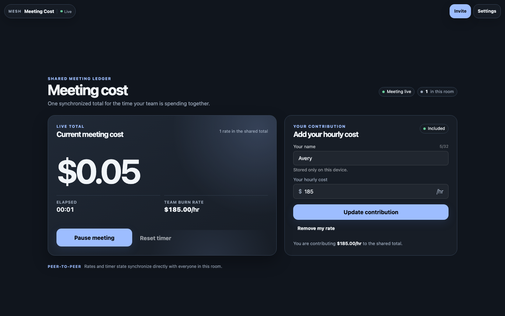

# Meeting Cost

[](https://baditaflorin.github.io/mesh-meeting-cost/)
[](https://github.com/baditaflorin/mesh-meeting-cost/blob/main/package.json)
[](./LICENSE)

> A peer-to-peer meeting ledger that shows one live, shared cost total.



Live: **https://baditaflorin.github.io/mesh-meeting-cost/**

Source: **https://github.com/baditaflorin/mesh-meeting-cost**

Tip the dev: **https://www.paypal.com/paypalme/florinbadita**

---

## What it is

Meeting Cost is a focused browser utility for teams that want to make meeting spend visible while the meeting is happening. Each person adds an hourly cost, then anyone in the room can start, pause, or reset the shared timer. The room shows one synchronized total and team burn rate.

It is peer-to-peer: no application backend stores a meeting ledger. Built on `@baditaflorin/mesh-common`, it is hosted on GitHub Pages from `docs/`.

## How a room works

1. Choose a local display name and hourly cost.
2. Add the rate to the room total; the number synchronizes directly to other peers.
3. Start the shared timer. Everyone sees the same elapsed time, team burn rate, and growing meeting cost.

Display names stay local to the browser. The numeric rate is shared so every peer can calculate the common total; see [Privacy](#privacy) for the complete boundary.

## Quickstart (local)

```bash
git clone https://github.com/baditaflorin/mesh-common
git clone https://github.com/baditaflorin/mesh-meeting-cost
cd mesh-meeting-cost
npm install
npm run dev
```

`mesh-common` must sit as a **sibling** directory because `package.json` references it via `file:../mesh-common`.

## Self-hosted infrastructure

| Repo                                              | Endpoint                               | Purpose                     |
| ------------------------------------------------- | -------------------------------------- | --------------------------- |
| https://github.com/baditaflorin/signaling-server  | `wss://turn.0docker.com/ws`            | y-webrtc signaling fan-out  |
| https://github.com/baditaflorin/turn-token-server | `https://turn.0docker.com/credentials` | HMAC TURN creds, 1-hour TTL |
| https://github.com/baditaflorin/coturn-hetzner    | `turn:turn.0docker.com:3479`           | TURN relay                  |

## Settings overrides (localStorage keys)

The settings drawer lets the user override signaling and TURN endpoints. Keys:

- `mesh-meeting-cost:signalingUrl`
- `mesh-meeting-cost:turnTokenUrl`
- `mesh-meeting-cost:iceServers`
- `mesh-meeting-cost:room`

If endpoints are blank or unreachable, the app falls back to STUN-only.

## Build & deploy

GitHub Pages serves the committed `docs/` directory on the `main` branch. There is **no GitHub Actions build workflow**; the Husky pre-commit + pre-push hooks gate formatting / typecheck / smoke build locally.

```bash
npm run smoke   # build + sanity-check docs/
```

To refresh the documentation preview after a build, serve `docs/` locally and run `npm run preview:capture` from a second terminal.

## Privacy

See `docs/privacy.md` for the threat model — what other peers in the mesh see, what the self-hosted infra sees, what stays local.

## License

MIT — see `LICENSE`.
